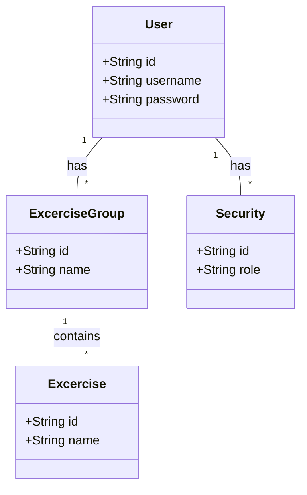

```mermaid
classDiagram
    class Excercise {
        +String id
        +String name
    }
    class ExcerciseGroup {
        +String id
        +String name
    }
    class User {
        +String id
        +String username
        +String password
    }
    class Security {
        +String id
        +String role
    }
    ExcerciseGroup "1"--"*" Excercise : contains
    User "1"--"*" ExcerciseGroup : has
    User "1"--"*" Security : has
```
