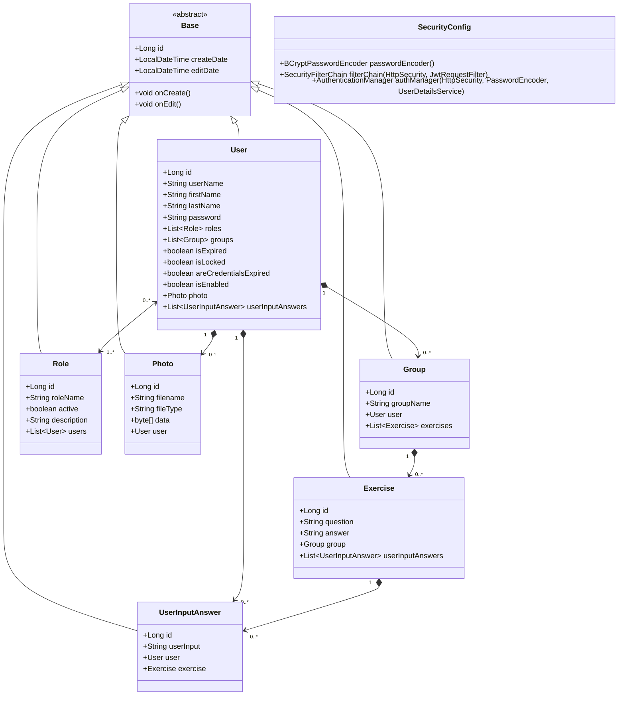

```mermaid
classDiagram
    direction TB

    class Base {
        <<abstract>>
        +Long id
        +LocalDateTime createDate
        +LocalDateTime editDate
        +void onCreate()
        +void onEdit()
    }

    class User {
        +Long id
        +String userName
        +String firstName
        +String lastName
        +String password
        +List~Role~ roles
        +List~Group~ groups
        +boolean isExpired
        +boolean isLocked
        +boolean areCredentialsExpired
        +boolean isEnabled
        +Photo photo
        +List~UserInputAnswer~ userInputAnswers
    }

    class Group {
        +Long id
        +String groupName
        +User user
        +List~Exercise~ exercises
    }

    class Exercise {
        +Long id
        +String question
        +String answer
        +Group group
        +List~UserInputAnswer~ userInputAnswers
    }

    class Role {
        +Long id
        +String roleName
        +boolean active
        +String description
        +List~User~ users
    }

    class Photo {
        +Long id
        +String filename
        +String fileType
        +byte[] data
        +User user
    }

    class UserInputAnswer {
        +Long id
        +String userInput
        +User user
        +Exercise exercise
    }

    class SecurityConfig {
        +BCryptPasswordEncoder passwordEncoder()
        +SecurityFilterChain filterChain(HttpSecurity, JwtRequestFilter)
        +AuthenticationManager authManager(HttpSecurity, PasswordEncoder, UserDetailsService)
    }

    Base <|-- User
    Base <|-- Group
    Base <|-- Exercise
    Base <|-- Role
    Base <|-- Photo
    Base <|-- UserInputAnswer

    User  "0..*" <--> "1..*" Role
    User "1"  *--> "0-1" Photo 
    User "1" *-->   "0..*" Group
    Group "1" *--> "0..*" Exercise 
    User "1" *--> "0..*" UserInputAnswer 
    Exercise "1" *--> "0..*" UserInputAnswer 
```