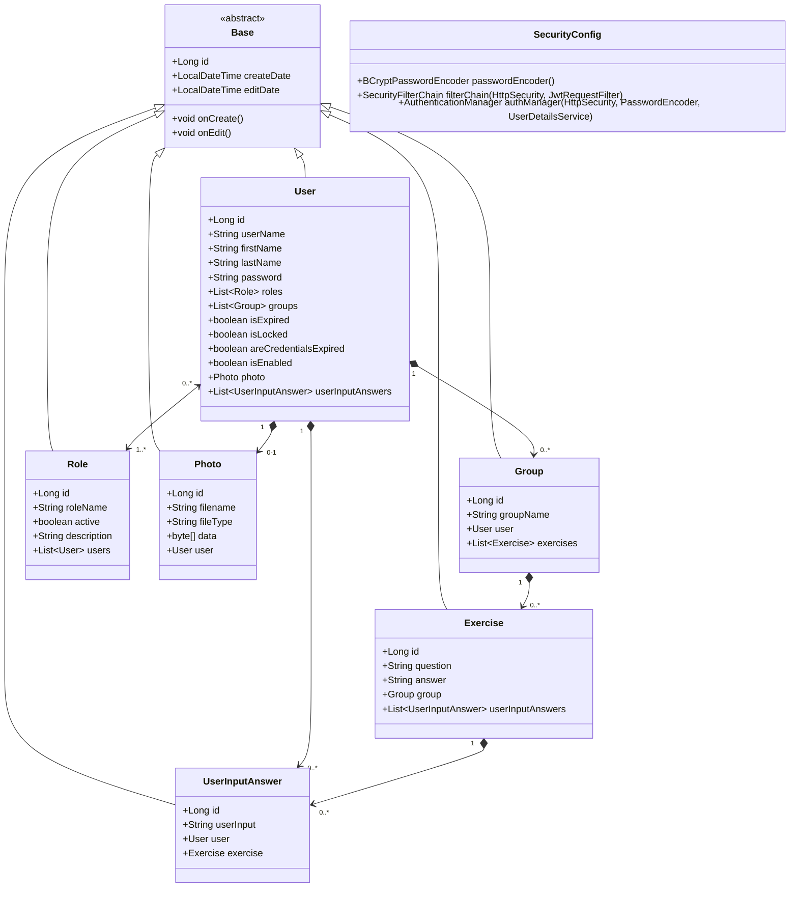

### Klassendiagram

## Toelichting
De applicatie is onderverdeeld in meerdere entiteiten en los de SecurityConfig. In de grafiek zie je de relaties en kardinaliteiten. Hieronder vind je een kleine toelichting op de onderdelen ter verduidelijking van de functie.

1. **SecurityConfig**:
    - Regelt de authenticatie en de authorisatie

2. **Base Entity**:
    - Een abstracte klasse die gemeenschappelijke velden en methoden biedt voor alle entiteiten, zoals `id`, `createDate` en `editDate`.

3. **User**:
   - In de User entity wordt informatie over de User opgeslagen
   - De User is ook gelinkt aan de oefendata en de antwoorden die zijn gegeven.. Group die weer Exercises bevat. Dit is gelinkt aan de User specifiek, zodat de data niet kan worden aangepast door andere Users.

4. **Group**:
    - Vertegenwoordigt een groep oefeningen (Exercises). 
    - De groep kan worden uitgebreid met meer Exercises

5. **Exercise**:
    - De oefening heeft een question en een answer.
    - De oefening moet zijn gelinkt aan een Group, als de Group verwijderd wordt, dan ook de Exercises.
    - Dit om een beter overzicht te houden en geen brei aan losse Exercises te krijgen

6. **Role**:
    - De User kan een Role hebben van User of Admin, of allebei
    - Als User kan je de Groups en Exercises maken
    - Als Admin heb je meer een beheerdersrol en kun je data verwijderen (die niet klopt, of om de database op te schonen)

7. **Photo**:
    - Een gebruiker (User en/of Admin) kan een enkele profielfoto uploaden
    - Als de gebruiker wordt verwijderd uit het systeem, wordt de Photo ook verwijderd.

8. **UserInputAnswer**:
    - Vertegenwoordigt een antwoord (input) die een User heeft gegeven op een Exercise
    - De UserInputAnswers worden als rauwe data opgeslagen, zodat de applicatie er zelf analyses op kan gaan uitvoeren