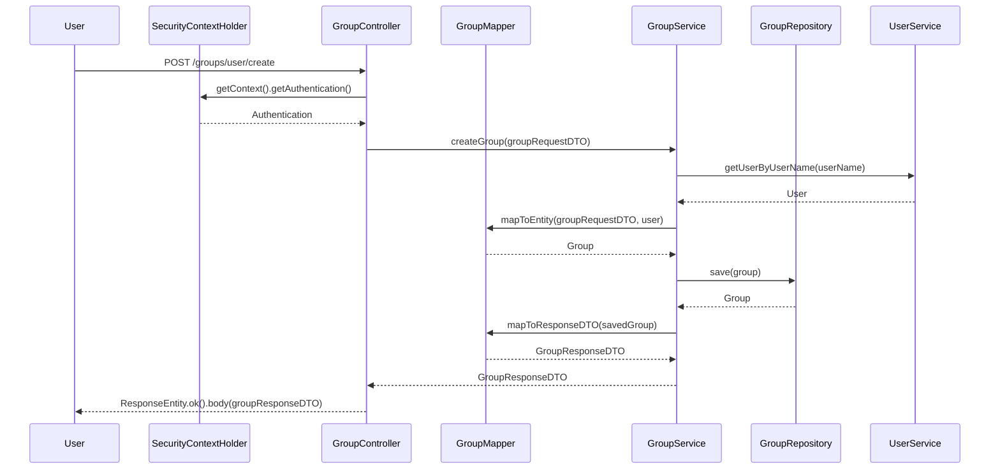

```mermaid
sequenceDiagram
    participant User
    participant SecurityContextHolder
    participant GroupController
    participant GroupMapper
    participant GroupService
    participant GroupRepository
    participant UserService

    User->>GroupController: POST /groups/user/create
    GroupController->>SecurityContextHolder: getContext().getAuthentication()
    SecurityContextHolder-->>GroupController: Authentication
    GroupController->>GroupService: createGroup(groupRequestDTO)
    GroupService->>UserService: getUserByUserName(userName)
    UserService-->>GroupService: User
    GroupService->>GroupMapper: mapToEntity(groupRequestDTO, user)
    GroupMapper-->>GroupService: Group
    GroupService->>GroupRepository: save(group)
    GroupRepository-->>GroupService: Group
    GroupService->>GroupMapper: mapToResponseDTO(savedGroup)
    GroupMapper-->>GroupService: GroupResponseDTO
    GroupService-->>GroupController: GroupResponseDTO
    GroupController-->>User: ResponseEntity.ok().body(groupResponseDTO)

```