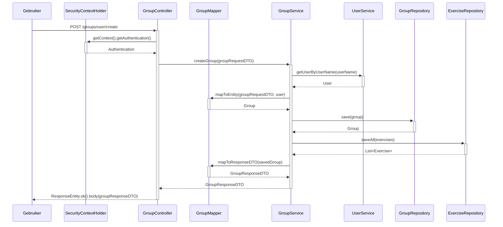

### Sequentiediagram voor `createGroup` (GroupController)

### Doel
De client kan een Group aanmaken waar Exercises in kunnen staan. Zowel de Group als de eventuele Exercises worden opgeslagen in de database en hebben een relatie met elkaar. De client krijgt een GroupResponseDTO terug waar in staat wat er gepersist is in de database. Dit om te checken of de data juist is.

### Stappen

1. **Gebruiker Initieert Verzoek**:
    - De gebruiker stuurt een POST-verzoek naar het eindpunt `/groups/user/create`.

2. **Controller Authenticatie**:
    - De `GroupController` ontvangt het verzoek en haalt de huidige authenticatiecontext op van `SecurityContextHolder`.

3. **Service Laag Interactie**:
    - De controller roept de `createGroup` methode van de `GroupService` aan, waarbij de `groupRequestDTO` wordt doorgegeven.

4. **Ophalen van Gebruiker**:
    - De `GroupService` roept de `UserService` aan om de gebruikersgegevens op te halen op basis van de gebruikersnaam.

5. **Mapping naar Entiteit**:
    - De `GroupService` roept de `GroupMapper` aan om de `groupRequestDTO` en gebruiker om te zetten naar een `Group` entiteit.

6. **Opslaan van Groep**:
    - De `GroupService` slaat de groep op door de `GroupRepository` aan te roepen.

7. **Opslaan van Oefeningen**:
    - De `GroupService` slaat de oefeningen die bij de groep horen op door de `ExerciseRepository` aan te roepen.

8. **Mapping naar Response DTO**:
    - De `GroupService` zet de opgeslagen groep om naar een response DTO met behulp van de `GroupMapper`.

9. **Respons naar Gebruiker**:
    - De `GroupService` retourneert de response DTO naar de `GroupController`, die vervolgens een HTTP 200 OK respons terugstuurt naar de gebruiker.

    