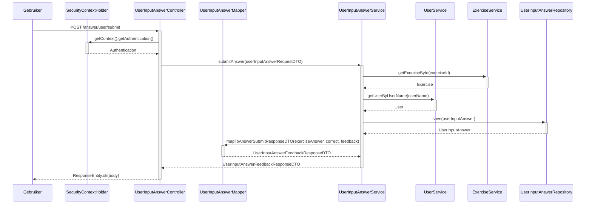

### Sequentiediagram voor submitAnswer (UserInputAnswerController)

## Sequentie diagram voor `submitAnswer` (InputAnswerController)

### Doel
De submitAnswer methode zorgt ervoor dat de client zijn antwoord (puur de input) op de vraag in de database kan opslaan. Daarnaast krijgt de client terug of het antwoord correct is, en wat extra feedback. Bijvoorbeeld of de accenten kloppen in het antwoord.

### Stappen

1. **Gebruiker Initieert Verzoek**:
    - De gebruiker stuurt een POST-verzoek naar het eindpunt `/answer/user/submit`.

2. **Controller Authenticatie**:
    - De `UserInputAnswerController` ontvangt het verzoek en haalt de huidige authenticatiecontext op van `SecurityContextHolder`.

3. **Service Laag Interactie**:
    - De controller roept de `submitAnswer` methode van de `UserInputAnswerService` aan, waarbij de `userInputAnswerRequestDTO` wordt doorgegeven.

4. **Ophalen van Oefening**:
    - De `UserInputAnswerService` roept de `ExerciseService` aan om de oefeningdetails op te halen met behulp van de opgegeven `exerciseId`.

5. **Ophalen van Gebruiker**:
    - De `UserInputAnswerService` roept de `UserService` aan om de gebruikersgegevens op te halen op basis van de gebruikersnaam.

6. **Opslaan van Antwoord**:
    - De `UserInputAnswerService` slaat het antwoord van de gebruiker op door de `UserInputAnswerRepository` aan te roepen.

7. **Respons Mapping**:
    - De `UserInputAnswerService` zet het opgeslagen antwoord om naar een response DTO met behulp van de `UserInputAnswerMapper`.

8. **Respons naar Gebruiker**:
    - De `UserInputAnswerService` retourneert de response DTO naar de `UserInputAnswerController`, die vervolgens een HTTP 200 OK respons terugstuurt naar de gebruiker.

